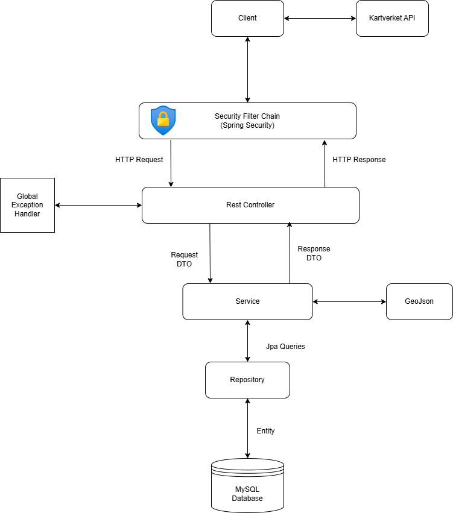

# Krisefikser
Krisefikser is a full-stack application built with Vue and Spring Boot. 
The project was developed as the sole assessment for the course `IDATT2106 Systemutvikling` in the Spring 2025 semester at NTNU.

**NB!** This repository contains the backend source code. You can find the **frontend** source code [here](https://gitlab.stud.idi.ntnu.no/idatt2106_2025_team10/frontend)

## The team
- Aryan Malekian
- Scott Langum du Plessis
- Jonathan Skomsøy Hübertz
- Mikael Stray Frøyshov
- Sander Sandvik Nessa
- Usman Ghafoorzai
- Sander Rusten Berge

## Table of contents

1. [The team](#the-team)  
2. [Overview](#overview)  
3. [Features](#features)  
4. [System Architecture](#system-architecture)  
5. [ER Diagram](#er-diagram)  
6. [Development & Test Setup](#development--test-setup)  
   1. [Prerequisites](#prerequisites)  
   2. [Spring Profiles (Backend)](#spring-profiles-backend)  
   3. [Backend Setup](#backend-setup)  
   4. [Frontend Setup](#frontend-setup)  
   5. [Running tests](#running-tests)  
   6. [Admin user credentials](#admin-user-credentials)  


## Overview
The project is a full-stack web application aiming to increase the overall level of personal preparedness in Norway.

The project utilizes the following technologies:
- **Frontend**: Vue 3
- **Backend**: Springboot V3 with Maven and Java 21
- **Database**: MySQL (production and development) and H2 (testing)

## Features
- **Secure login**: Users can securely log in and register, with email verification and recaptcha
- **Household**: Users can join or create a household
- **Emergency storage**: Users can add items to their emergency storage and see the preparedness level of their household
- **Notifications**: Users can receive notifications such as reminders for low stock or upcoming expiration dates
- **Map**: Users can see crisis areas, shelters, defibrillators, and other important locations on a map, as well as their own location and the location of their household
- **Admin map**: Admins can add, update and create locations and events to the map for users to see in real-time
- **Quiz**: Users can take a quiz to test their preparedness level and see the history of their past quizzes
- **Reflection**: Users can reflect on their preparedness level and choose to share their reflections with their household, the public, or keep them private. Users can also see the reflections of their household members and the public


## System Architecture


## ER Diagram


## Development & Test Setup

### Prerequisites 

**Backend**
- JDK 21
- Maven 

**Frontend**  
- npm

### Spring Profiles (Backend)
The backend uses Spring profiles to separate dev and test configurations:

- `application-dev.properties` is used during local development and under production
- `application-test.properties` is used for running the tests in memory
- Common config is stored in `application.properties`

### Backend Setup
1. **Clone the repository**
```bash
git clone https://gitlab.stud.idi.ntnu.no/idatt2106_2025_team10/backend.git
cd backend
```
2. **Configure environment variables**  
Copy or obtain your `.env` / credentials file. 

3. **Run in development mode**  
   ```bash
   mvn spring-boot:run -Dspring-boot.run.profiles=dev
   ```
  
4. **Run the application with in memory db for testing**  
   ```bash
   mvn spring-boot:run -Dspring-boot.run.profiles=test
   ```
### Frontend Setup

1. **Clone the frontend repository**  
   ```bash
   git clone https://gitlab.stud.idi.ntnu.no/idatt2106_2025_team10/frontend.git
   cd frontend
   ```
2. **Install dependencies**  
   ```bash
   npm install
   ```
3. **Configure environment variables**  
Copy or obtain your `.env` / credentials file. 

4. **Run in development mode**  
   ```bash
   npm run dev
   ```  
   The app will be available at `http://localhost:5173`  

You can find the swagger API documentation [here](https://backend-91339c.pages.stud.idi.ntnu.no/swagger-ui/)
Or by running dev backend locally and going [here](https://localhost:8443/swagger-ui/index.html)

#### Running tests
Open the root folder of the backend and type ```mvn test``` in the terminal

To see the backend test coverage go [here](https://backend-91339c.pages.stud.idi.ntnu.no/jacoco/) or open the root folder of the backend, type ```mvn clean verify```, then go to target/site/jaccoco and open the index.html in a browser.

#### Admin user credentials
- Email: test@example.com
- Password: testpassword
